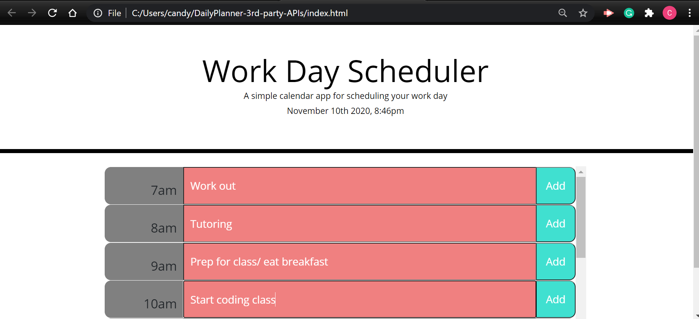

# planner--3rd-party-APIs

* This app is supposed to help the user plan their daily activities by organizing them into each hour time slot. 

* The HTML file was provided and only one change was made. I added the ID displayContent to the container DIV to display the rows and columns where the time, the to-do items, and the add button are held. 

* Most of the Style.css file was provided. I added styling to the class description, rows, add button, and the color change for the past, present, and future. I also adjusted the color scheme and font size to make the page look relatively proportionate in size. 

* I had a hard time with Json and stingifying the information to the local storage. I

Link to the website app:  https://candygarcia014.github.io/DailyPlanner-3rd-party-APIs/

Link to the Github Repo: https://github.com/candygarcia014/DailyPlanner-3rd-party-APIs

* screenshot of my deployed application: 

